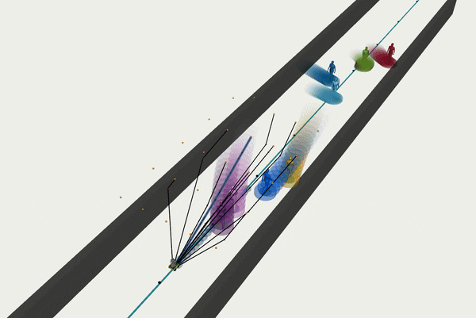

[](https://github.com/oscardegroot/mpc-planner/actions/workflows/main.yml)


# robot-Agnostic Trajectory Optimization (ATO)
This package implements robot agnostic Model Predictive Control (MPC) for motion planning in dynamic environments.


## Installation (Solver Generation)
The NMPC solver is generated with Forces Pro. For now it is assumed that your Forces directory is placed at `~/forces_pro_client/`. To setup a virtual environment for the solver generation, install `python 3.8.10` (https://www.python.org/downloads/release/python-3810/). Then run:

```bash
poetry install
```

To generate a solver for your system (e.g., `jackal`), run

```bash
poetry run python mpc-planner-jackal/scripts/generate_jackal_solver.py
```

## Installation (Planning)
To install dependencies, run:

```bash
rosdep install --from-paths src --ignore-src -r -y
```

<details>
<summary>Ignoring a system</summary>
To ignore a system you do not care about use:

```bash
rosdep install --from-paths src --ignore-src -r -y --skip-keys="mpc-planner-jackal"
```
</details>


Build the repository (`source devel/setup.sh`):

```bash
catkin config --cmake-args -DCMAKE_BUILD_TYPE=Release
catkin build mpc-planner-<system>
```

## Running
Each system should define its own launch files to launch requirements and this planning node. For example:

```bash
roslaunch mpc-planner-jackal jackalsimulator.launch
```

that contains

```xml
  <rosparam command="load" file="$(find mpc-planner-jackal)/config/guidance_planner.yaml"/>
  <node pkg="mpc-planner-jackal" type="jackal_planner" name="jackal_planner" respawn="false" output="screen">
        <remap from="/input/state" to="robot_state"/>
        <remap from="/input/goal" to="/goal_pose"/>
        <remap from="/input/reference_path" to="roadmap/reference"/>
        <remap from="/input/obstacles" to="/pedestrian_simulator/trajectory_predictions"/>
        <remap from="/output/command" to="/cmd_vel"/>
  </node>
```

**Example Output:**


