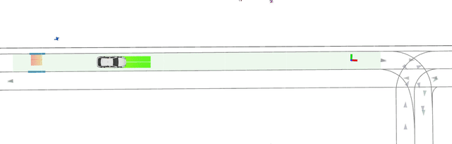
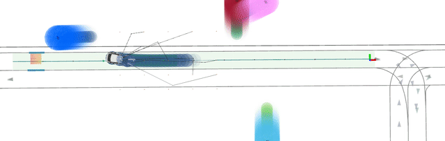

# Autoware Planner
This package implements a motion planner for Autoware.


## Usage

1. **Generate a solver:** The planner requires a solver to run. To generate the solver, run the following python file with the poetry environment:
```bash
poetry run python mpc_planner_autoware/scripts/generate_autoware_solver.py
``` 
This step requires an internet connection. After about a minute you should see that a solver is generated.


2. **Enable the license:** On the Prius, you can start the floating license using `start_license` in de account `Oscar de Groot`.

3. **Run the planner:** The planner should be included in `autoware.launch`, otherwise you can run it separately with:

```
ros2 launch mpc_planner_autoware ros2_autoware.launch
```

Example simulation outputs in RViz:





### Debugging
- If you see `exit_code: -100`, then there is a license error. Check if you forgot to start step `2` above.
- You can record pedestrian scenarios using a `VSCode` task. Use `p` to set a pedestrian and `g` to finalize the scenario. Make sure to build after recording so that it gets installed to share.


**Inputs:**
- Vehicle state (x, y, psi, v)
- Vehicle steering state (delta)
- A reference path (retrieved from Lanelets by `lanelets_to_path`)
- (simulation) Virtual pedestrians and their predictions

**Outputs:**
- Trajectory (x, y, psi, v at N steps into the future)

### Dependencies
```
git clone https://gitlab.tudelft.nl/intelligent-vehicles/lanelets_to_path
git clone https://github.com/oscardegroot/pedestrian_simulator.git
git clone https://github.com/oscardegroot/pedsim_original.git
```