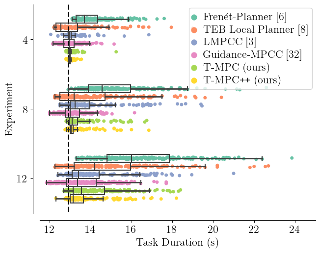

# Jackal Simulator
This package implements motion planning on the [Clearpath Jackal](https://www.clearpathrobotics.com/assets/guides/noetic/jackal/simulation.html) in simulation.

Pedestrians are simulated with [`pedestrian_simulator`](https://github.com/oscardegroot/pedestrian_simulator) that builds on top of [`libpedsim`](https://github.com/chgloor/pedsim.git) to implement the social forces pedestrian model.

The pedestrian scenario can be selected in the launch file. See `pedestrian_simulator/scenarios/` for available options. The reference path that the robot should follow is also configured in the launch file. See `roadmap/roadmap/maps/`.

Comparitive results on this corridor baseline with 4, 8 and 12 pedestrians shows that **T-MPC++** can outperform non-parallelized MPC (`LMPCC`) as well as other planners.

